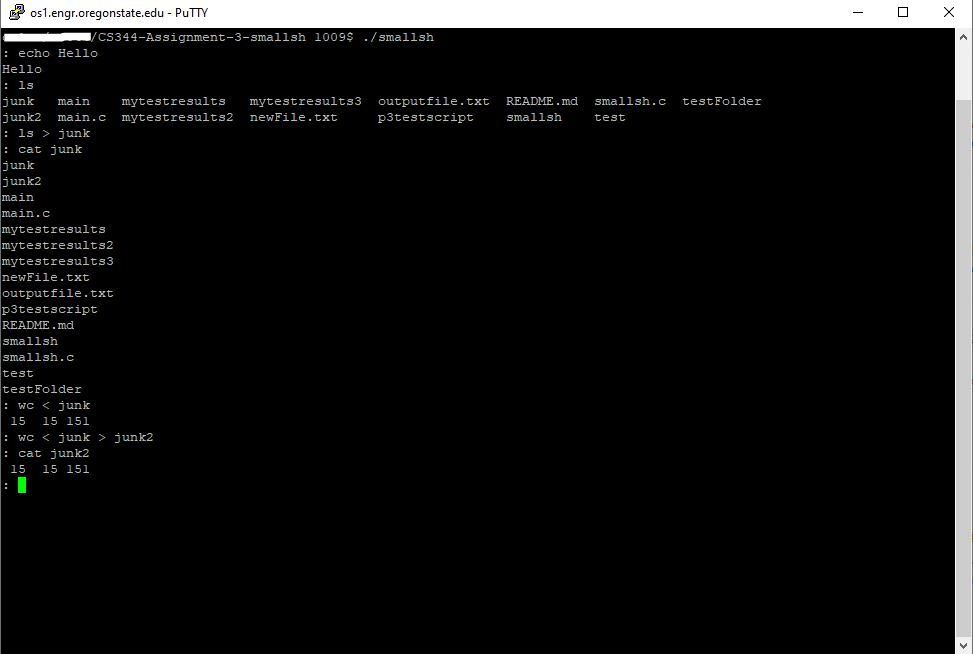

# CS344-Assignment-3-smallsh
Assignment 3: smallsh (Portfolio Assignment)

This program will be your shell! This is a small shell that is written in C.

## Program image

## How to run the program

1. Save `smallsh.c` and `p3testscript` file in your folder.
2. Run `gcc -o smallsh smallsh.c` in your terminal.
3. You can run by using below command:

To run the program:
`$ ./smallsh`

To run the test script:
`$ ./p3testscript 2>&1`
or

`$ ./p3testscript 2>&1 | more`
or

`$ ./p3testscript > mytestresults 2>&1 `
